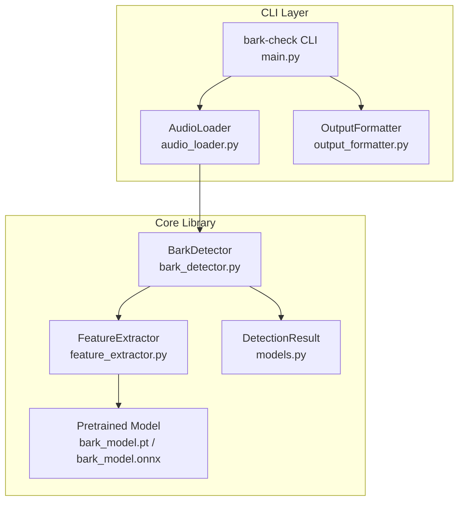

# Design Document: bark-check

## Overview

bark-check は、音声ファイルを入力として犬の吠え声（bark）を検出する Python CLI ツールである。
判定ロジックはコアライブラリ `BarkDetector` として独立しており、CLI はそのラッパーに過ぎない。
この分離により、iOS Swift アプリ等の他プラットフォームへの同一アルゴリズムの移植・転用を容易にする。

### 主要設計方針

- **コアライブラリの完全独立性**: `BarkDetector` は CLI 固有の依存（argparse 等）を一切持たず、float32 モノラル PCM 配列 + サンプリングレートのみを入力とする純粋な関数型インターフェースを提供する。
- **detect() はエラーを例外で伝播しない**: `BarkDetector.detect()` は推論エラーを含む全てのエラー情報を `DetectionResult.error` フィールドに格納し、呼び出し元に例外を伝播しない。ただし初期化 (`__init__`) など、失敗が致命的な操作は例外を送出する。

---

## Architecture



### レイヤー構成

| レイヤー | モジュール | 役割 |
|---|---|---|
| CLI | `main.py` | 引数解析、エラー処理、終了コード管理 |
| CLI | `audio_loader.py` | 音声ファイルのデコードと PCM 変換 |
| CLI | `output_formatter.py` | テキスト／JSON 出力フォーマット |
| Core | `bark_detector.py` | 犬の吠え声判定ロジック |
| Core | `feature_extractor.py` | PCM → MFCC 特徴量抽出 |
| Core | `models.py` | DetectionResult データモデル |

---

## Components and Interfaces

### BarkDetector

コアライブラリの主エントリポイント。CLI 依存を一切持たない。

```python
class BarkDetector:
    """犬の吠え声を検出するコアライブラリ。"""

    def __init__(self, threshold: float = 0.5, model_path: str | None = None) -> None:
        """BarkDetector を初期化する。

        Args:
            threshold: 吠え声判定の閾値。0.0 以上 1.0 以下の範囲で指定する。
            model_path: 事前学習済みモデルのパス。None の場合はデフォルトモデルを使用する。

        Raises:
            ValueError: threshold が [0.0, 1.0] の範囲外の場合。
            ModelLoadError: モデルの読み込みに失敗した場合。
        """

    def detect(self, pcm: np.ndarray, sample_rate: int) -> DetectionResult:
        """モノラル PCM データから犬の吠え声を検出する。

        例外は発生しない。エラーは DetectionResult.error に格納される。

        Args:
            pcm: float32 型のモノラル PCM サンプル配列 (shape: [N])。
            sample_rate: サンプリングレート（Hz）。

        Returns:
            is_bark, confidence, timestamp, audio_duration, error を含む判定結果。
        """
```

### FeatureExtractor

```python
class FeatureExtractor:
    """PCM データから機械学習モデルへの入力特徴量を抽出する。"""

    def extract(self, pcm: np.ndarray, sample_rate: int) -> np.ndarray:
        """モノラル PCM から MFCC 特徴量を抽出する。

        Args:
            pcm: float32 型のモノラル PCM サンプル配列 (shape: [N])。
            sample_rate: サンプリングレート（Hz）。

        Returns:
            MFCC 特徴量テンソル (shape: [T, N_MFCC])。
        """
```

### AudioLoader

```python
class AudioLoader:
    """音声ファイルをデコードしてモノラル PCM に変換する。"""

    SUPPORTED_FORMATS = ("wav", "mp3", "flac", "ogg")

    def load(self, file_path: str) -> tuple[np.ndarray, int]:
        """音声ファイルをデコードしてモノラル float32 PCM に変換する。

        Args:
            file_path: 音声ファイルのパス。

        Returns:
            (pcm, sample_rate) のタプル。pcm は float32 配列、sample_rate は Hz。

        Raises:
            FileNotFoundError: ファイルが存在しない場合。
            UnsupportedFormatError: 対応外の拡張子の場合。
            AudioLoadError: ファイルのデコードに失敗した場合。
        """
```

### DetectionResult

```python
@dataclass
class DetectionResult:
    """判定結果を表すデータ構造。"""

    is_bark: bool
    confidence: float          # 0.0 <= confidence <= 1.0
    timestamp: float           # Unix タイムスタンプ（秒）
    audio_duration: float      # 音声の長さ（秒）
    error: str | None = None   # エラーメッセージ。エラーなしの場合は None

    def to_json(self) -> str:
        """DetectionResult を JSON 文字列にシリアライズする。

        Returns:
            is_bark, confidence, timestamp, audio_duration, error を含む JSON 文字列。
        """

    @classmethod
    def from_json(cls, json_str: str) -> "DetectionResult":
        """JSON 文字列から DetectionResult をデシリアライズする。

        パースエラーや必須フィールド欠落の場合は、error フィールドにメッセージを
        格納した DetectionResult を返す。例外は発生しない。

        Args:
            json_str: デシリアライズ対象の JSON 文字列。

        Returns:
            復元された DetectionResult。エラー時は error フィールドにメッセージを含む。
        """
```

### CLI インターフェース

```
usage: bark-check [-h] [--json] [--threshold THRESHOLD] audio_file

positional arguments:
  audio_file            判定対象の音声ファイルパス (WAV, MP3, FLAC, OGG)

options:
  -h, --help            使用方法を表示して終了
  --json                結果を JSON 形式で出力する
  --threshold FLOAT     判定閾値 (0.0〜1.0, デフォルト: 0.5)
```

**終了コード:**

| コード | 意味 |
|---|---|
| 0 | 吠え声あり（正常終了） |
| 1 | 入力エラー（ファイル未指定・存在しない・読み込み失敗・推論エラー等） |
| 2 | 非対応フォーマット |
| 3 | 吠え声なし（正常終了） |
| 4 | モデル読み込み失敗 |

---

## Data Models

### DetectionResult フィールド定義

| フィールド | 型 | 説明 | 必須 |
|---|---|---|---|
| `is_bark` | `bool` | 吠え声の有無 | ✓ |
| `confidence` | `float` | 予測の確からしさ (0.0〜1.0) | ✓ |
| `timestamp` | `float` | 判定実行時の Unix タイムスタンプ（秒） | ✓ |
| `audio_duration` | `float` | 入力音声の長さ（秒） | ✓ |
| `error` | `str \| None` | エラーメッセージ。正常時は `null` | ✓ |

### JSON 出力例

**正常時（吠え声あり）:**
```json
{
  "is_bark": true,
  "confidence": 0.87,
  "timestamp": 1718000000.123456,
  "audio_duration": 1.5,
  "error": null
}
```

**エラー時:**
```json
{
  "is_bark": false,
  "confidence": 0.0,
  "timestamp": 1718000000.0,
  "audio_duration": 0.0,
  "error": "Input PCM block is empty"
}
```

### FeatureExtractor 仕様（Requirement 4.3 に対応）

| パラメータ | 値 | 説明 |
|---|---|---|
| 特徴量の種類 | MFCC | Mel-Frequency Cepstral Coefficients |
| サンプリングレート | 16,000 Hz | 入力 PCM を 16kHz にリサンプリングして処理 |
| フレームサイズ | 400 サンプル (25ms) | FFT 窓サイズ |
| フレームシフト | 160 サンプル (10ms) | 隣接フレーム間のオフセット |
| MFCC 係数数 | 40 | 抽出する MFCC 次元数 |
| 出力形状 | [T, 40] | T = フレーム数 |

### モデル仕様（Requirement 4.4 に対応）

| 項目 | 値 |
|---|---|
| アーキテクチャ | 軽量 CNN (例: MobileNet-V2 ベース 1D CNN) |
| フレームワーク | PyTorch (推論は ONNX Runtime または TorchScript) |
| 入力テンソル形状 | `[1, T, 40]` (batch=1, frames, mfcc_dims) — float32 |
| 出力テンソル形状 | `[1, 1]` (bark_probability) — float32 |
| 最大入力長 | 時間長 10.0 秒以内（サンプリングレート非依存。モデルは Global Average Pooling により任意長対応） |

> **設計判断**: モデルを ONNX 形式で保持することで、PyTorch 非依存の推論（`onnxruntime` のみ）を実現する。

---

## Correctness Properties

プロパティとは、システムの全ての有効な実行において成立すべき特性や振る舞いのことである。つまり、システムが何をすべきかについての形式的な記述である。プロパティは、人間が読める仕様と機械で検証可能な正しさの保証をつなぐ橋渡しとなる。

### Property 1: 有効な PCM 入力は常に有効な DetectionResult を返す

時間長制限内（`len(pcm) / sample_rate <= 10.0`）の空でない float32 PCM 配列と任意の有効なサンプリングレートが与えられた場合、`BarkDetector.detect()` は `is_bark` が bool 型、`confidence` が [0.0, 1.0] の範囲内、かつ `error` フィールドが常に存在する（null または空でない文字列）`DetectionResult` を返さなければならない。

**Validates: Requirements 2.1, 5.4**

### Property 2: 閾値による吠え声判定の一貫性

[0.0, 1.0] の範囲内の任意の confidence 値 `c` と任意の閾値 `t` に対して、`DetectionResult` の `is_bark` フィールドは `(c >= t)` と等しくなければならない。どの入力の組み合わせでも、閾値ルールに矛盾する結果が生成されてはならない。

**Validates: Requirements 2.2, 2.3**

### Property 3: 時間長超過入力はエラー DetectionResult を返す

`len(pcm) / sample_rate > 10.0` を満たす任意の入力に対して、`BarkDetector.detect()` は `error="Input exceeds maximum duration of 10.0 seconds"`, `is_bark=False`, `confidence=0.0` の `DetectionResult` を返さなければならない。

**Validates: Requirements 2.8**

### Property 4: 無効拡張子は常に終了コード 2 で拒否される

拡張子が `{"wav", "mp3", "flac", "ogg"}` のいずれでもない（大文字小文字を問わない）任意のファイルパスに対して、CLI は終了コード 2 で終了し、対応フォーマットの一覧を含むエラーメッセージを標準エラー出力に出力しなければならない。

**Validates: Requirements 1.3**

### Property 5: --json 出力は常に有効なスキーマを持つ

`--json` フラグを指定して処理された任意の有効な音声入力に対して、CLI の出力は少なくとも `is_bark`（bool 型）と `confidence`（[0.0, 1.0] の float 型）フィールドを含む有効な JSON でなければならない。

**Validates: Requirements 3.2**

### Property 6: 無音入力は常に confidence 0.0 の吠え声なしを返す

有効な長さ（1〜32,000 サンプル）の任意の全ゼロ float32 配列に対して、`BarkDetector.detect()` は `is_bark` が `False`、`confidence` が `0.0` の `DetectionResult` を返さなければならない。

**Validates: Requirements 5.3**

### Property 7: 推論エラーは DetectionResult に格納され例外は伝播しない

モデル推論中に実行時エラーを引き起こす任意の入力（例: モックされた例外）に対して、`BarkDetector.detect()` は null でない `error` フィールドを持つ `DetectionResult` を返さなければならず、呼び出し元に例外を発生させてはならない。

**Validates: Requirements 5.1, 5.6**

### Property 8: DetectionResult のシリアライズ・デシリアライズ ラウンドトリップ

任意の有効な `DetectionResult` オブジェクトに対して、`to_json()` で JSON にシリアライズし `from_json()` でデシリアライズすると、元のオブジェクトと等価なオブジェクトが生成されなければならない。`confidence` は小数点以下 6 桁以上の精度、`timestamp` は秒単位の精度で保持されること。

**Validates: Requirements 6.1, 6.2, 6.3**

### Property 9: 不正 JSON は error フィールドを持つ DetectionResult を返す

有効な JSON 構文でない任意の文字列に対して、`DetectionResult.from_json()` はパースエラーメッセージを含む null でない `error` フィールドを持つ `DetectionResult` を返さなければならず、例外を発生させてはならない。

**Validates: Requirements 6.4**

### Property 10: 必須フィールド欠落 JSON は欠落フィールド名をエラーに含む DetectionResult を返す

必須フィールド（`is_bark`、`confidence`）の一方または両方が欠落した任意の有効な JSON オブジェクトに対して、`DetectionResult.from_json()` は `error` フィールドに欠落フィールド名を含む `DetectionResult` を返さなければならない。

**Validates: Requirements 6.5**

---

## Error Handling

### BarkDetector のエラー処理方針

`BarkDetector.detect()` は **例外を呼び出し元に伝播しない** 設計とする。全てのエラーは `DetectionResult.error` に格納される。一方、初期化 (`__init__`) は、失敗が致命的であるため例外を送出する。

| エラー条件 | `DetectionResult` の状態 |
|---|---|
| 空の PCM ブロック (length == 0) | `is_bark=False`, `confidence=0.0`, `error="Input PCM block is empty"` |
| PCM 時間長が 10.0 秒超 | `is_bark=False`, `confidence=0.0`, `error="Input exceeds maximum duration of 10.0 seconds"` |
| 無音入力 (全ゼロ) | `is_bark=False`, `confidence=0.0`, `error=None` |
| モデルが未ロード（session is None） | `is_bark=False`, `confidence=0.0`, `error="No model loaded"` |
| 推論中ランタイムエラー | `is_bark=False`, `confidence=0.0`, `error="Inference error: <message>"` |

**BarkDetector の例外送出（detect() 以外）**

| メソッド | エラー条件 | 例外 |
|---|---|---|
| `__init__` | threshold が [0.0, 1.0] 範囲外 | `ValueError` |
| `__init__` | model_path のファイルが存在しない / 読み込み失敗 | `ModelLoadError` |

### CLI のエラー処理方針

CLI レイヤーは例外を受け取り、適切な終了コードと stderr メッセージに変換する。

| エラー条件 | stderr メッセージ | 終了コード |
|---|---|---|
| 引数未指定 | 使用方法を表示 | 1 |
| ファイルが存在しない | `"Error: File not found: <path>"` | 1 |
| 非対応フォーマット | `"Error: Unsupported format. Supported: wav, mp3, flac, ogg"` | 2 |
| ファイル読み込み失敗 | `"Error: Failed to load audio file: <reason>"` | 1 |
| モデル読み込み失敗 | `"Error: Failed to load model: <reason>"` | 4 |
| 閾値が範囲外 | `"Error: --threshold must be between 0.0 and 1.0"` | 1 |
| 推論エラー | `"Error: Detection failed: <reason>"` | 1 |

### AudioLoader のエラー処理方針

`AudioLoader.load()` は検出したエラーを例外として送出する（CLI がキャッチして終了コードに変換する）。

```
FileNotFoundError     → CLI が終了コード 1 で処理
UnsupportedFormatError → CLI が終了コード 2 で処理
AudioLoadError         → CLI が終了コード 1 で処理
```

---

## Testing Strategy

### 全体方針

bark-check は **ユニットテスト** と **プロパティベーステスト (PBT)** の二段構えで品質を保証する。

- **ユニットテスト**: 具体的な入力・出力例の検証、エッジケース、統合ポイント
- **プロパティベーステスト**: 全入力空間にわたる普遍的な性質の検証（上記 Correctness Properties に対応）

### テストフレームワーク

| 用途 | ライブラリ |
|---|---|
| ユニットテスト | `pytest` |
| プロパティベーステスト | `hypothesis` |
| モック | `unittest.mock` |
| 音声生成 | `numpy`（テスト用 PCM 合成） |

### プロパティベーステスト設定

- 各プロパティテストは最低 **100 イテレーション** を実行する（Hypothesis のデフォルト: `settings(max_examples=100)`）
- 各テストには設計ドキュメントのプロパティへの参照コメントを付与する
- タグ形式: `# Feature: bark-check, Property {N}: {property_text}`

### テストファイル構成

```
tests/
├── test_detection_result.py       # Property 8, 9, 10 (シリアライズ round-trip)
├── test_bark_detector.py          # Property 1, 2, 3, 6, 7 (コアロジック)
├── test_feature_extractor.py      # FeatureExtractor ユニットテスト
├── test_cli.py                    # Property 4, 5 + CLI統合テスト
└── test_audio_loader.py           # AudioLoader ユニットテスト
```

### ユニットテスト対象（主要ケース）

| テスト | 対象 | 内容 |
|---|---|---|
| `test_detect_valid_wav` | `BarkDetector` | 有効な WAV ファイルから正常な DetectionResult が返ること |
| `test_threshold_default` | `BarkDetector` | デフォルト閾値が 0.5 であること |
| `test_cli_help` | CLI | `--help` で使用方法が表示されること |
| `test_cli_exit_code_bark` | CLI | 吠え声あり判定で終了コード 0 |
| `test_cli_exit_code_no_bark` | CLI | 吠え声なし判定で終了コード 3 |
| `test_cli_json_output` | CLI | `--json` で JSON が標準出力に出力されること |
| `test_cli_threshold_option` | CLI | `--threshold 0.7` が BarkDetector に渡されること |
| `test_model_load_failure` | CLI | モデル読み込み失敗で終了コード 4 |
| `test_inference_latency` | `BarkDetector` | 2 秒の PCM で推論が 500ms 以内に完了すること（ベンチマーク） |

### プロパティテスト例（Hypothesis）

```python
from hypothesis import given, settings
from hypothesis import strategies as st
import numpy as np

# Feature: bark-check, Property 1: 有効な PCM 入力は常に有効な DetectionResult を返す
@given(
    pcm=st.lists(st.floats(-1.0, 1.0, allow_nan=False, allow_infinity=False),
                 min_size=1, max_size=32000).map(lambda x: np.array(x, dtype=np.float32)),
    sample_rate=st.integers(min_value=8000, max_value=48000)
)
@settings(max_examples=100)
def test_property_valid_pcm_returns_valid_result(pcm, sample_rate):
    detector = BarkDetector()
    result = detector.detect(pcm, sample_rate)
    assert isinstance(result.is_bark, bool)
    assert 0.0 <= result.confidence <= 1.0
    assert hasattr(result, "error")

# Feature: bark-check, Property 8: DetectionResult のシリアライズ・デシリアライズ ラウンドトリップ
@given(
    is_bark=st.booleans(),
    confidence=st.floats(0.0, 1.0, allow_nan=False),
    timestamp=st.floats(0.0, 2e9, allow_nan=False),
    audio_duration=st.floats(0.0, 2.0, allow_nan=False)
)
@settings(max_examples=100)
def test_property_round_trip(is_bark, confidence, timestamp, audio_duration):
    original = DetectionResult(
        is_bark=is_bark, confidence=confidence,
        timestamp=timestamp, audio_duration=audio_duration
    )
    restored = DetectionResult.from_json(original.to_json())
    assert restored.is_bark == original.is_bark
    assert abs(restored.confidence - original.confidence) < 1e-6
    assert abs(restored.timestamp - original.timestamp) < 1.0
```

### 統合テスト

実際の音声ファイルを使用した End-to-End テストは `tests/integration/` に格納し、CI での実行は任意とする。

```
tests/integration/
├── sample_bark.wav    # 犬の吠え声サンプル
├── sample_silence.wav # 無音サンプル
└── test_end_to_end.py
```
