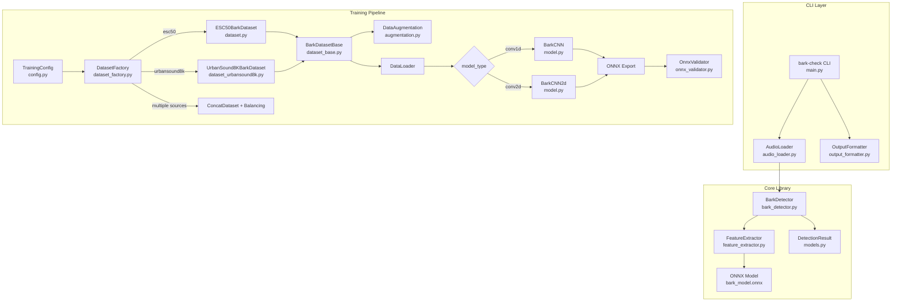
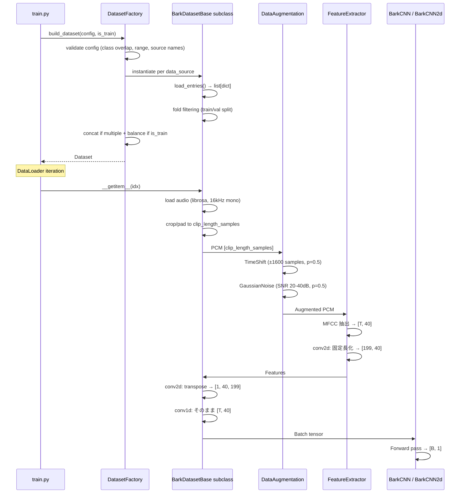
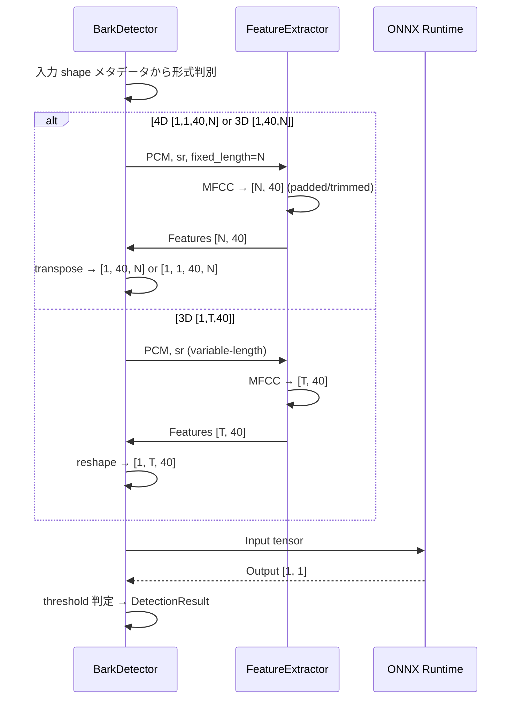

# Design Document: bark-check

## Overview

bark-check は、音声ファイルを入力として犬の吠え声（bark）を検出する Python CLI ツールである。
判定ロジックはコアライブラリ `BarkDetector` として独立しており、CLI はそのラッパーに過ぎない。
この分離により、iOS Swift アプリ等の他プラットフォームへの同一アルゴリズムの移植・転用を容易にする。

学習パイプライン（`training/`）は ESC-50 および UrbanSound8K データセットを使用して 2 種類のモデルを学習する:
- **BarkCNN** (Conv1d): 可変長入力対応、CLI 推論向け
- **BarkCNN2d** (Conv2d): 固定長 4D 入力、CoreML (iOS 12) 互換 ONNX エクスポート向け

データセット層は `BarkDatasetBase` 抽象基底クラスにより統一され、`ESC50BarkDataset` と `UrbanSound8KBarkDataset` が個別のデータソースを担当する。`DatasetFactory` が `TrainingConfig.data_sources` 設定に基づいてデータセットの選択・結合・クラスバランス調整を行い、`train.py` はファクトリ経由でデータセットを取得する。

### 主要設計方針

- **コアライブラリの完全独立性**: `BarkDetector` は CLI 固有の依存を持たず、float32 モノラル PCM + サンプリングレートのみを入力とする
- **detect() はエラーを例外で伝播しない**: 全てのエラー情報を `DetectionResult.error` フィールドに格納する
- **モデル自動判別**: BarkDetector は ONNX 入力 shape メタデータからモデル形式を自動判別する
- **CoreML 互換性**: Conv2d モデルは opset 9、全軸静的、許可オペレータのみで ONNX エクスポートする
- **マルチデータソース対応**: Dataset 層を抽象基底クラスで統一し、DatasetFactory パターンで複数データソースの結合を管理する

---

## Architecture

### システム全体構成



### レイヤー構成

| レイヤー | モジュール | 役割 |
|---|---|---|
| CLI | `main.py` | 引数解析、エラー処理、終了コード管理 |
| CLI | `audio_loader.py` | 音声ファイルのデコードと PCM 変換 |
| CLI | `output_formatter.py` | テキスト／JSON 出力フォーマット |
| Core | `bark_detector.py` | 犬の吠え声判定ロジック（モデル自動判別） |
| Core | `feature_extractor.py` | PCM → MFCC 特徴量抽出（可変長/固定長） |
| Core | `models.py` | DetectionResult データモデル |
| Training | `training/config.py` | TrainingConfig データクラス |
| Training | `training/dataset_base.py` | BarkDatasetBase 抽象基底クラス |
| Training | `training/dataset.py` | ESC50BarkDataset + ダウンロード |
| Training | `training/dataset_urbansound8k.py` | UrbanSound8KBarkDataset |
| Training | `training/dataset_factory.py` | DatasetFactory（データソース選択・結合・バランス調整） |
| Training | `training/augmentation.py` | データ拡張（タイムシフト、ガウシアンノイズ） |
| Training | `training/model.py` | BarkCNN, BarkCNN2d モデル定義 |
| Training | `training/train.py` | 学習ループ + ONNX エクスポート |
| Training | `training/onnx_validator.py` | ONNX CoreML 互換性検証 |

### 学習パイプライン データフロー



### 推論パイプライン データフロー



---

## Components and Interfaces

### BarkDetector

コアライブラリの主エントリポイント。CLI 依存を一切持たない。

```python
class BarkDetector:
    def __init__(self, threshold: float = 0.5, model_path: str | None = None) -> None:
        """BarkDetector を初期化する。
        Raises: ValueError (threshold 範囲外), ModelLoadError (モデル読み込み失敗)
        """

    def _load_model(self, model_path: str) -> None:
        """ONNX モデルを読み込み、入力形状からモデル形式を自動判別する。
        判別ロジック:
        - [1, 1, 40, N] → 4D CoreML 互換 (self._is_4d=True, self._channels_first=True)
        - [1, 40, N]    → 3D channels-first 固定長
        - [1, T, 40]    → 3D channels-last 可変長
        """

    def detect(self, pcm: np.ndarray, sample_rate: int) -> DetectionResult:
        """モノラル PCM データから犬の吠え声を検出する。例外は伝播しない。"""
```

### FeatureExtractor

```python
class FeatureExtractor:
    def extract(self, pcm: np.ndarray, sample_rate: int, fixed_length: int | None = None) -> np.ndarray:
        """モノラル PCM から MFCC 特徴量を抽出する。
        fixed_length 指定時: [fixed_length, 40] (パディング/切り詰め)
        未指定時: [T, 40] (可変長)
        """
```

### AudioLoader

```python
class AudioLoader:
    SUPPORTED_FORMATS = ("wav", "mp3", "flac", "ogg")

    def load(self, file_path: str) -> tuple[np.ndarray, int]:
        """音声ファイルをデコードしてモノラル float32 PCM に変換する。
        Raises: FileNotFoundError, UnsupportedFormatError, AudioLoadError
        """
```

### DetectionResult

```python
@dataclass
class DetectionResult:
    is_bark: bool
    confidence: float          # 0.0 <= confidence <= 1.0
    timestamp: float           # Unix タイムスタンプ（秒）
    audio_duration: float      # 音声の長さ（秒）
    error: str | None = None

    def to_json(self) -> str: ...
    @classmethod
    def from_json(cls, json_str: str) -> "DetectionResult": ...
```

### BarkCNN（Conv1d 可変長モデル）

```python
class BarkCNN(nn.Module):
    """可変長入力 1D CNN。入力: [B, T, 40] → 出力: [B, 1]
    構成: permute → Conv1d(40,64,3) → BN → ReLU → MaxPool(2)
         → Conv1d(64,128,3) → BN → ReLU → MaxPool(2)
         → Conv1d(128,128,3) → BN → ReLU → GAP → Dropout → Linear(128,1) → Sigmoid
    """
    def __init__(self, dropout_rate: float = 0.3) -> None: ...
    def forward(self, x: torch.Tensor) -> torch.Tensor: ...
```

### BarkCNN2d（Conv2d CoreML 互換モデル）

```python
class BarkCNN2d(nn.Module):
    """CoreML 互換の Conv2d ベース犬の吠え声検出モデル。
    入力: [B, 1, 40, 199] → 出力: [B, 1]

    内部で [B, 1, 40, 199] → [B, 40, 1, 199] に permute し、
    Conv2d((1,3)) で時間軸方向のみに畳み込む（Conv1d と数学的に等価）。

    構成:
        permute → Conv2d(40, 64, (1,3), p=(0,1)) → BN2d → ReLU → MaxPool2d((1,2))
        → Conv2d(64, 128, (1,3), p=(0,1)) → BN2d → ReLU → MaxPool2d((1,2))
        → Conv2d(128, 128, (1,3), p=(0,1)) → BN2d → ReLU
        → AdaptiveAvgPool2d((1,1)) → Dropout(0.3) → Linear(128, 1) → Sigmoid
    """
    def __init__(self, dropout_rate: float = 0.3) -> None: ...
    def forward(self, x: torch.Tensor) -> torch.Tensor: ...
```

**Conv2d と Conv1d の数学的等価性**:
Conv1d(40, 64, kernel_size=3, padding=1) を入力 [B, 40, 199] に適用する演算は、
Conv2d(40, 64, kernel_size=(1,3), padding=(0,1)) を入力 [B, 40, 1, 199] に適用する演算と
数学的に同一である。カーネル (1,3) は H=1 方向では畳み込まず、W 方向のみで処理するため。

**パラメータ数**: 82,497（200,000 以下の制約を満たす）

### TrainingConfig

```python
@dataclass
class TrainingConfig:
    data_dir: Path = Path("data/ESC-50-master")
    output_model_path: Path = Path("models/bark_model.onnx")
    positive_classes: list[int] = [0]       # 0=dog
    negative_classes: list[int] = [5, 20, 21, 22, 23, 24, 26, 30]
    val_fold: int = 5
    sample_rate: int = 16000
    clip_duration_sec: float = 2.0
    epochs: int = 50
    batch_size: int = 32
    learning_rate: float = 1e-3
    fixed_frame_length: int = 199
    dropout_rate: float = 0.3
    use_augmentation: bool = True
    model_type: str = "conv2d"              # "conv1d" or "conv2d"
    augmentation_probability: float = 0.5
    random_seed: int = 42

    # データソース設定
    data_sources: list[str] = ["esc50"]     # 有効値: "esc50", "urbansound8k"
    urbansound8k_dir: Path = Path("data/UrbanSound8K")
    urbansound8k_positive_classes: list[int] = [3]      # 3=dog_bark
    urbansound8k_negative_classes: list[int] = [2, 8, 1, 5]  # children_playing, siren, car_horn, engine_idling
    urbansound8k_val_fold: int = 10         # 1〜10
```

### BarkDatasetBase（`training/dataset_base.py`）

抽象基底クラス。音声読み込み→クロップ/パディング→拡張→MFCC 抽出の共通パイプラインを集約する。

```python
class BarkDatasetBase(Dataset, ABC):
    """複数データソースに対応する抽象基底データセット。"""

    def __init__(self, config: TrainingConfig, *, is_train: bool = True) -> None: ...

    @abstractmethod
    def load_entries(self) -> list[dict]:
        """データソース固有のメタデータを読み込み、統一形式のエントリリストを返す。
        Returns: 各エントリは {"filepath": Path, "label": int, "fold": int} を含む。
        """
        ...

    @abstractmethod
    def _get_val_fold(self) -> int:
        """バリデーション fold 番号を返す。"""
        ...

    def __len__(self) -> int: ...
    def __getitem__(self, idx: int) -> tuple[torch.Tensor, torch.Tensor]:
        """音声読み込み → クロップ/パディング → 拡張 → MFCC 抽出 → テンソル変換。
        conv2d: [1, 40, 199], conv1d: [T, 40]。ファイル不在時は FileNotFoundError。
        """
        ...
```

### ESC50BarkDataset（`training/dataset.py`）

BarkDatasetBase を継承し、ESC-50 固有のメタデータ読み込みを実装する。コンストラクタのシグネチャ `(config: TrainingConfig, *, is_train: bool)` を維持し後方互換性を確保する。

```python
class ESC50BarkDataset(BarkDatasetBase):
    """ESC-50 データソースに特化した Dataset。
    model_type=="conv2d": features shape [1, 40, 199], label shape [1]
    model_type=="conv1d": features shape [T, 40], label shape [1]
    """
    def __init__(self, config: TrainingConfig, *, is_train: bool = True) -> None: ...
    def _get_val_fold(self) -> int: ...
    def load_entries(self) -> list[dict]: ...
    def __getitem__(self, idx: int) -> tuple[torch.Tensor, torch.Tensor]: ...
```

### UrbanSound8KBarkDataset（`training/dataset_urbansound8k.py`）

UrbanSound8K 固有のメタデータ読み込みを実装する。

```python
class UrbanSound8KBarkDataset(BarkDatasetBase):
    """UrbanSound8K データソースに特化した Dataset。"""

    def _get_val_fold(self) -> int: ...
    def load_entries(self) -> list[dict]: ...
```

### DatasetFactory（`training/dataset_factory.py`）

TrainingConfig に基づいてデータセットを構築するファクトリモジュール。バリデーション、インスタンス化、結合、クラスバランス調整を担当する。

```python
_VALID_SOURCES = {"esc50", "urbansound8k"}

def build_dataset(config: TrainingConfig, *, is_train: bool) -> Dataset:
    """TrainingConfig に基づいてデータセットを構築する。
    Raises: ValueError (無効な設定), FileNotFoundError (UrbanSound8K 未検出)
    """
    ...

def _validate_config(config: TrainingConfig) -> None:
    """data_sources とクラス設定のバリデーション。"""
    ...

def _check_urbansound8k_available(config: TrainingConfig) -> None:
    """UrbanSound8K メタデータの存在確認。"""
    ...

def _apply_class_balance(dataset: Dataset) -> Dataset:
    """正例のオーバーサンプリングでクラスバランスを調整する。"""
    ...
```

### データ拡張関数

```python
def apply_time_shift(pcm: np.ndarray, max_shift: int = 1600) -> np.ndarray:
    """±max_shift サンプル範囲でランダムシフト。範囲外はゼロ埋め。"""

def apply_gaussian_noise(pcm: np.ndarray, snr_min: float = 20.0, snr_max: float = 40.0) -> np.ndarray:
    """SNR [snr_min, snr_max] dB のガウシアンノイズを付加する。"""
```

### OnnxValidator

```python
def validate_onnx_for_coreml(model_path: str) -> list[str]:
    """ONNX の CoreML 互換性を検証する。
    検証: 入力 shape [1,1,40,199], 出力 [1,1], opset 9, 全軸固定, 許可オペレータのみ。
    Returns: 失敗エラーメッセージリスト（空なら全合格）。
    """
```

### CLI インターフェース

```
usage: bark-check [-h] [--json] [--threshold THRESHOLD] [--model MODEL] audio_file

positional arguments:
  audio_file            判定対象の音声ファイルパス (WAV, MP3, FLAC, OGG)

options:
  --json                結果を JSON 形式で出力する
  --threshold FLOAT     判定閾値 (0.0〜1.0, デフォルト: 0.5)
  --model PATH          ONNX モデルファイルパス
```

**終了コード:**

| コード | 意味 |
|---|---|
| 0 | 吠え声あり（正常終了） |
| 1 | 入力エラー（ファイル未指定・存在しない・読み込み失敗・推論エラー等） |
| 2 | 非対応フォーマット |
| 3 | 吠え声なし（正常終了） |
| 4 | モデル読み込み失敗 |

---

## Data Models

### FeatureExtractor 仕様

| パラメータ | 値 | 説明 |
|---|---|---|
| 特徴量の種類 | MFCC | Mel-Frequency Cepstral Coefficients |
| サンプリングレート | 16,000 Hz | 入力 PCM を 16kHz にリサンプリングして処理 |
| フレームサイズ | 400 サンプル (25ms) | FFT 窓サイズ |
| フレームシフト | 160 サンプル (10ms) | 隣接フレーム間のオフセット |
| MFCC 係数数 | 40 | 抽出する MFCC 次元数 |
| 出力形状（可変長） | [T, 40] | T = フレーム数 |
| 出力形状（固定長） | [199, 40] | fixed_length=199 指定時 |

### 固定フレーム長の導出

| パラメータ | 値 |
|---|---|
| サンプリングレート | 16,000 Hz |
| クロップ長 | 2.0 秒 |
| PCM サンプル数 | 32,000 |
| フレームシフト (hop_length) | 160 サンプル |
| フレームサイズ (n_fft) | 400 サンプル |
| MFCC フレーム数 | 199 (librosa center=True での実測値) |

### モデル仕様テーブル

| 項目 | BarkCNN (conv1d) | BarkCNN2d (conv2d) |
|---|---|---|
| 入力テンソル形状 | `[1, T, 40]` | `[1, 1, 40, 199]` |
| 入力データ型 | float32 | float32 |
| 出力テンソル形状 | `[1, 1]` | `[1, 1]` |
| 出力値域 | 0.0〜1.0 | 0.0〜1.0 |
| 可変長対応 | ✓ (GAP) | ✗ (固定長) |
| dynamic_axes | あり | なし（全軸静的） |
| CoreML 互換 | ✗ | ✓ (opset 9) |
| パラメータ数 | ~82,000 | ~82,497 |
| Dropout | あり (0.3) | あり (0.3) |
| 学習時 MFCC | 可変長 | 固定長 (199) |
| データ拡張 | あり | あり |
| 用途 | CLI 推論 | iOS アプリ |

### ONNX エクスポート仕様（Conv2d）

| 項目 | 値 |
|---|---|
| opset_version | 9 |
| input_names | `["input"]` |
| output_names | `["output"]` |
| dynamic_axes | なし（全軸静的） |
| 入力 shape | `[1, 1, 40, 199]` |
| 出力 shape | `[1, 1]` |

### 許可オペレータ一覧

| オペレータ | 用途 |
|---|---|
| Conv | Conv2d レイヤー |
| Relu | 活性化関数 |
| BatchNormalization | バッチ正規化 |
| MaxPool | ダウンサンプリング |
| AveragePool / GlobalAveragePool | Global Average Pooling |
| Reshape | テンソル形状変換 |
| Gemm | 全結合層（Linear） |
| Sigmoid | 出力活性化 |
| Constant | 定数テンソル |
| Squeeze | 次元削減 |
| Transpose | permute 操作 |

### BarkDetector モデル形式自動判別ロジック

```
ONNX 入力 shape を取得
├── 4D: len(shape) == 4
│   ├── shape[1]==1 && shape[2]==40 → 4D CoreML 互換 (fixed_length=shape[3])
│   └── それ以外 → エラー
├── 3D: len(shape) == 3
│   ├── shape[1] == 40 → channels-first 固定長 (fixed_length=shape[2])
│   ├── shape[2] == 40 → channels-last 可変長
│   └── それ以外 → エラー
└── それ以外 → エラー
```

### テンソル形状遷移（BarkCNN2d）

```
入力:          [B, 1, 40, 199]
permute:       [B, 40, 1, 199]
Conv2d Block1: [B, 64, 1, 199] → MaxPool2d → [B, 64, 1, 99]
Conv2d Block2: [B, 128, 1, 99] → MaxPool2d → [B, 128, 1, 49]
Conv2d Block3: [B, 128, 1, 49]
GAP:           [B, 128, 1, 1]
view:          [B, 128]
Dropout:       [B, 128]
Linear:        [B, 1]
Sigmoid:       [B, 1]  (values in [0.0, 1.0])
```

### JSON 出力例

**正常時（吠え声あり）:**
```json
{
  "is_bark": true,
  "confidence": 0.87,
  "timestamp": 1718000000.123456,
  "audio_duration": 1.5,
  "error": null
}
```

### エントリ辞書（load_entries() の返却型）

| キー | 型 | 説明 |
|---|---|---|
| `filepath` | `Path` | 音声ファイルの絶対/相対パス |
| `label` | `int` | 0（負例）または 1（正例） |
| `fold` | `int` | クロスバリデーション fold 番号（1 以上） |

### TrainingConfig 追加フィールド一覧

| フィールド | 型 | デフォルト値 | 説明 |
|---|---|---|---|
| `data_sources` | `list[str]` | `["esc50"]` | 使用データソース |
| `urbansound8k_dir` | `Path` | `Path("data/UrbanSound8K")` | UrbanSound8K ルートディレクトリ |
| `urbansound8k_positive_classes` | `list[int]` | `[3]` | UrbanSound8K 正例クラスID |
| `urbansound8k_negative_classes` | `list[int]` | `[2, 8, 1, 5]` | UrbanSound8K 負例クラスID |
| `urbansound8k_val_fold` | `int` | `10` | UrbanSound8K バリデーション fold |

### UrbanSound8K メタデータ CSV カラム

| カラム | 型 | 説明 |
|---|---|---|
| `slice_file_name` | `str` | 音声ファイル名 |
| `fsID` | `int` | Freesound ID |
| `start` | `float` | 開始時刻（秒） |
| `end` | `float` | 終了時刻（秒） |
| `salience` | `int` | 顕著性 (1=foreground, 2=background) |
| `fold` | `int` | Fold 番号（1〜10） |
| `classID` | `int` | クラス番号（0〜9） |
| `class` | `str` | クラス名 |

### UrbanSound8K classID マッピング

| classID | class name | 用途 |
|---|---|---|
| 0 | air_conditioner | — |
| 1 | car_horn | 負例（デフォルト） |
| 2 | children_playing | 負例（デフォルト） |
| 3 | dog_bark | 正例（デフォルト） |
| 4 | drilling | — |
| 5 | engine_idling | 負例（デフォルト） |
| 6 | gun_shot | — |
| 7 | jackhammer | — |
| 8 | siren | 負例（デフォルト） |
| 9 | street_music | — |

---

## Error Handling

### BarkDetector のエラー処理方針

`BarkDetector.detect()` は **例外を呼び出し元に伝播しない** 設計とする。

| エラー条件 | `DetectionResult` の状態 |
|---|---|
| 空の PCM ブロック (length == 0) | `is_bark=False`, `confidence=0.0`, `error="Input PCM block is empty"` |
| PCM 時間長が 10.0 秒超 | `is_bark=False`, `confidence=0.0`, `error="Input exceeds maximum duration of 10.0 seconds"` |
| 無音入力 (全ゼロ) | `is_bark=False`, `confidence=0.0`, `error=None` |
| モデルが未ロード | `is_bark=False`, `confidence=0.0`, `error="No model loaded"` |
| モデル形式不明 | `is_bark=False`, `confidence=0.0`, `error="Unsupported model format: ..."` |
| 推論中ランタイムエラー | `is_bark=False`, `confidence=0.0`, `error="Inference error: <message>"` |

### CLI のエラー処理

| エラー条件 | stderr メッセージ | 終了コード |
|---|---|---|
| 引数未指定 | 使用方法を表示 | 1 |
| ファイルが存在しない | `"Error: File not found: <path>"` | 1 |
| 非対応フォーマット | `"Error: Unsupported format. Supported: wav, mp3, flac, ogg"` | 2 |
| ファイル読み込み失敗 | `"Error: Failed to load audio file: <reason>"` | 1 |
| モデル読み込み失敗 | `"Error: Failed to load model: <reason>"` | 4 |
| 閾値が範囲外 | `"Error: --threshold must be between 0.0 and 1.0"` | 1 |
| 推論エラー | `"Error: Detection failed: <reason>"` | 1 |

### ONNX Validator のエラー処理

全検証項目を実行し、失敗した項目のリストを返す。呼び出し側が結果に応じてメッセージ出力と終了コードを制御する。

### 学習パイプラインの終了コード

| 条件 | 終了コード |
|---|---|
| 学習・エクスポート・検証全て成功 | 0 |
| ONNX 検証失敗 (conv2d) | 1 |
| データセット読み込み失敗 | 1 |

### DatasetFactory のバリデーションエラー（ValueError）

| 条件 | エラーメッセージ | 発生箇所 |
|---|---|---|
| 未知のデータソース名 | `"Unknown data source: '{name}'. Valid sources: ['esc50', 'urbansound8k']"` | `_validate_config()` |
| classID 重複 | `"UrbanSound8K positive/negative class overlap: {ids}"` | `_validate_config()` |
| classID 範囲外 | `"Invalid UrbanSound8K classID: {id}. Must be 0-9."` | `_validate_config()` |

### DatasetFactory のファイル不在エラー（FileNotFoundError）

| 条件 | エラーメッセージ | 発生箇所 |
|---|---|---|
| UrbanSound8K CSV 未検出 | ダウンロード URL + 期待ディレクトリ構成を含むメッセージ | `_check_urbansound8k_available()` |
| 音声ファイル未検出 | `"Audio file not found: {filepath}"` | `BarkDatasetBase.__getitem__()` |

### DatasetFactory エラー処理方針

- **フォールバックなし**: UrbanSound8K が見つからない場合、他のデータソースへのフォールバックは行わない。明示的にエラーで停止する。
- **Early fail**: バリデーションは `build_dataset()` の冒頭で実施し、データセット構築前に全ての設定不備を検出する。
- **自動ダウンロードなし**: UrbanSound8K はライセンス制約（CC BY-NC 4.0）により自動ダウンロードを行わない。エラーメッセージに手動ダウンロード手順を含める。

---

## Correctness Properties

プロパティとは、システムの全ての有効な実行において成立すべき特性や振る舞いのことである。

### Property 1: 有効な PCM 入力は常に有効な DetectionResult を返す

時間長制限内（`len(pcm) / sample_rate <= 10.0`）の空でない float32 PCM 配列と任意の有効なサンプリングレートが与えられた場合、`BarkDetector.detect()` は `is_bark` が bool 型、`confidence` が [0.0, 1.0] の範囲内、かつ `error` フィールドが常に存在する `DetectionResult` を返さなければならない。

**Validates: Requirements 2.1, 5.4**

### Property 2: 閾値による吠え声判定の一貫性

[0.0, 1.0] の範囲内の任意の confidence 値 `c` と任意の閾値 `t` に対して、`DetectionResult` の `is_bark` フィールドは `(c >= t)` と等しくなければならない。

**Validates: Requirements 2.2, 2.3**

### Property 3: 時間長超過入力はエラー DetectionResult を返す

`len(pcm) / sample_rate > 10.0` を満たす任意の入力に対して、`BarkDetector.detect()` は `error="Input exceeds maximum duration of 10.0 seconds"`, `is_bark=False`, `confidence=0.0` の `DetectionResult` を返さなければならない。

**Validates: Requirements 2.7**

### Property 4: 無効拡張子は常に終了コード 2 で拒否される

拡張子が `{"wav", "mp3", "flac", "ogg"}` のいずれでもない任意のファイルパスに対して、CLI は終了コード 2 で終了しなければならない。

**Validates: Requirements 1.3**

### Property 5: --json 出力は常に有効なスキーマを持つ

`--json` フラグを指定して処理された任意の有効な音声入力に対して、CLI の出力は `is_bark`（bool）と `confidence`（[0.0, 1.0]）フィールドを含む有効な JSON でなければならない。

**Validates: Requirements 3.2**

### Property 6: 無音入力は常に confidence 0.0 の吠え声なしを返す

有効な長さの任意の全ゼロ float32 配列に対して、`BarkDetector.detect()` は `is_bark=False`, `confidence=0.0` を返さなければならない。

**Validates: Requirements 5.3**

### Property 7: 推論エラーは DetectionResult に格納され例外は伝播しない

モデル推論中にランタイムエラーを引き起こす任意の入力に対して、`BarkDetector.detect()` は null でない `error` フィールドを持つ `DetectionResult` を返し、例外を発生させてはならない。

**Validates: Requirements 5.1, 5.6**

### Property 8: DetectionResult のシリアライズ・デシリアライズ ラウンドトリップ

任意の有効な `DetectionResult` に対して、`to_json()` → `from_json()` で元と等価なオブジェクトが生成されなければならない。

**Validates: Requirements 6.1, 6.2, 6.3**

### Property 9: 不正 JSON は error フィールドを持つ DetectionResult を返す

有効な JSON でない任意の文字列に対して、`from_json()` はパースエラーメッセージを含む `error` フィールドを持つ `DetectionResult` を返し、例外を発生させてはならない。

**Validates: Requirements 6.4**

### Property 10: 必須フィールド欠落 JSON は欠落フィールド名をエラーに含む

必須フィールドが欠落した JSON に対して、`from_json()` は欠落フィールド名を含む `error` を持つ `DetectionResult` を返さなければならない。

**Validates: Requirements 6.5**

### Property 11: ONNX 推論は任意の有効入力に対して有界な確率値を返す

任意の shape `[1, 1, 40, 199]` の float32 テンソル（NaN・Inf を含まない）に対して、BarkCNN2d の ONNX モデルを推論した結果は shape `[1, 1]` であり、出力値は 0.0 以上 1.0 以下である。

**Validates: Requirements 7.6, 8.5**

### Property 12: データセットは常に固定長特徴量を返す（conv2d モード）

model_type="conv2d" の ESC50BarkDataset の任意のインデックスに対して、features テンソルの shape は `[1, 40, 199]` であり、全要素が有限値である。

**Validates: Requirements 8.1, 10.3**

### Property 13: FeatureExtractor 固定長モードは任意の PCM 長に対して [199, 40] を返す

任意の長さ（1 サンプル以上）の有効な float32 PCM と有効なサンプリングレートに対して、`extract(pcm, sr, fixed_length=199)` の出力は常に shape `[199, 40]` であり、全要素が有限値である。

**Validates: Requirements 12.1, 12.2**

### Property 14: データ拡張は信号長と有限性を保存する

任意の長さの有限値 float32 PCM に対して、`apply_time_shift()` および `apply_gaussian_noise()` の出力は元と同じ長さであり、全要素が有限値である。

**Validates: Requirements 10.1, 10.2, 10.5**

### Property 15: バリデーションモードは決定論的な出力を返す

ESC50BarkDataset（`is_train=False`）から同じインデックスのサンプルを複数回取得した場合、返される features テンソルは完全に一致する。

**Validates: Requirements 10.3**

### Property 16: Conv2d と Conv1d の数値的等価性

任意の入力テンソルに対して、BarkCNN2d と BarkCNN に同一の重みパラメータを設定した場合、両モデルの出力は浮動小数点誤差（1e-5 以内）で一致する。

**Validates: Requirements 8.1, 8.2, 8.3, 8.4**

### Property 17: ラベル割り当て正確性

任意の UrbanSound8K メタデータエントリにおいて、load_entries() が返すエントリの label 値は、classID が urbansound8k_positive_classes に含まれる場合は 1、urbansound8k_negative_classes に含まれる場合は 0 となる。同様に ESC50BarkDataset においても、target が positive_classes に含まれる場合は 1、negative_classes に含まれる場合は 0 となる。

**Validates: Requirements 13.1, 14.1**

### Property 18: ゼロパディング不変量

任意の clip_length_samples 未満の長さの音声データに対して、BarkDatasetBase のクロップ/パディング処理後の出力長は常に clip_length_samples と等しく、末尾にゼロが付加される。

**Validates: Requirements 13.2**

### Property 19: Fold 分割正確性

任意の load_entries() が返すエントリ集合に対して、is_train=True のとき結果に val_fold のエントリは含まれず、is_train=False のとき結果は val_fold のエントリのみで構成される。

**Validates: Requirements 13.3, 17.4**

### Property 20: 設定バリデーション

任意の TrainingConfig において、(a) data_sources に "esc50" および "urbansound8k" 以外の文字列が含まれる場合、(b) urbansound8k_positive_classes と urbansound8k_negative_classes に重複する classID がある場合、(c) UrbanSound8K の classID に 0〜9 範囲外の値が含まれる場合、DatasetFactory は ValueError を発生させる。

**Validates: Requirements 14.4, 14.5, 16.5, 17.6**

### Property 21: エントリ契約

任意の BarkDatasetBase のサブクラスにおいて、load_entries() が返す全エントリは "filepath"（Path 型）、"label"（0 または 1 の整数）、"fold"（1 以上の正の整数）のキーを含む。

**Validates: Requirements 15.3**

### Property 22: 出力テンソル形状

任意の有効なエントリに対して、model_type が "conv2d" のとき __getitem__ は shape [1, 40, fixed_frame_length] の float32 テンソルを返し、model_type が "conv1d" のとき shape [T, 40]（T ≥ 1）の float32 テンソルを返す。ラベルは常に shape [1] の float32 テンソルで値は 0.0 または 1.0 である。

**Validates: Requirements 15.4**

### Property 23: クラスバランス

任意の正例と負例の両方を含む学習用エントリ集合に対して、オーバーサンプリング後の正例数と負例数の差は 1 以下である（|positives - negatives| ≤ 1）。

**Validates: Requirements 17.3**

### Property 24: ConcatDataset 長さの加法性

任意の複数データソースの組み合わせにおいて、結合後のデータセット長は各個別データセット長の合計に等しい（クラスバランス調整前）。

**Validates: Requirements 17.2**

---

## Testing Strategy

### テストフレームワーク

| 用途 | ライブラリ |
|---|---|
| ユニットテスト | `pytest` |
| プロパティベーステスト | `hypothesis` |
| モック | `unittest.mock` |
| テンソル生成 | `numpy`, `hypothesis.extra.numpy` |

### テストファイル構成

```
tests/
├── test_detection_result.py       # Property 8, 9, 10
├── test_bark_detector.py          # Property 1, 2, 3, 6, 7
├── test_feature_extractor.py      # Property 13 + ユニットテスト
├── test_feature_extractor_fixed.py # 固定長モード PBT
├── test_cli.py                    # Property 4, 5 + CLI 統合テスト
├── test_audio_loader.py           # AudioLoader ユニットテスト
├── test_bark_cnn_fixed.py         # Property 11, 12 + モデルアーキテクチャ
├── test_data_augmentation.py      # Property 14, 15
├── test_onnx_validator.py         # ONNX 検証スモークテスト
├── test_bark_detector_compat.py   # Property 16 + モデル自動判別
├── test_training_config.py        # TrainingConfig フィールド検証
├── test_dataset_properties.py     # Property 17-24（UrbanSound8K 統合 PBT）
├── test_dataset_factory.py        # DatasetFactory バリデーション・構築ロジック
└── test_dataset_base.py           # BarkDatasetBase インタフェース
```

### プロパティベーステスト設定

- 各テストは最低 100 イテレーション（`@settings(max_examples=100)`）
- タグ形式: `# Feature: bark-check, Property {N}: {property_text}`

### UrbanSound8K 統合テスト方針

- Property 17-21, 23-24: メタデータのモック生成（CSV 内容を Hypothesis で生成）で検証。実音声ファイルは不要。
- Property 22: 短いランダム PCM 配列を生成し、FeatureExtractor のモックまたは実行で出力形状を検証。
