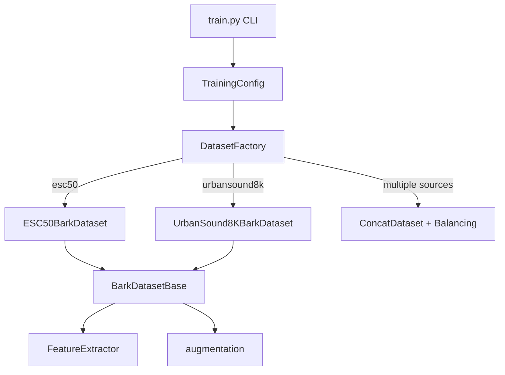
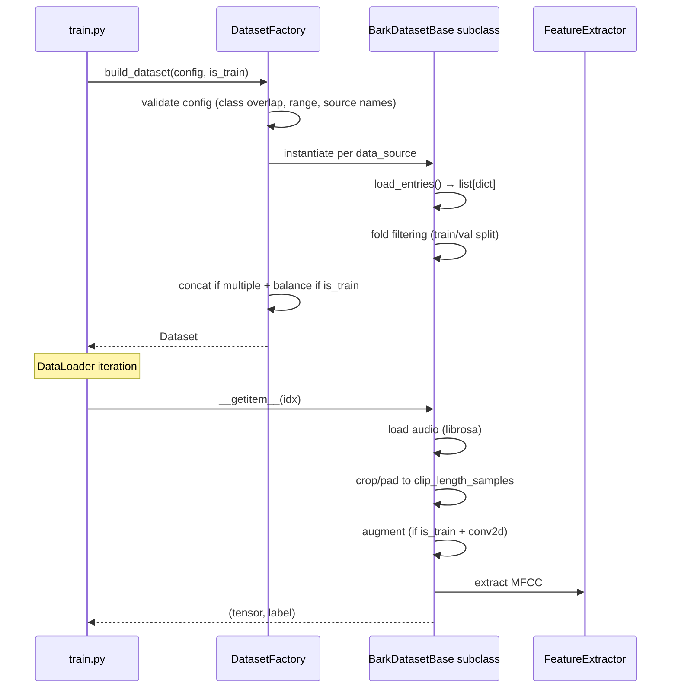

# Design Document: UrbanSound8K Integration

## Overview

UrbanSound8K データセットを既存の犬の吠え声検出学習パイプラインに統合する。現行の ESC-50 専用の `ESC50BarkDataset` をリファクタリングし、抽象基底クラス `BarkDatasetBase` を導入することで、複数データソースを統一的に扱えるアーキテクチャに再設計する。`DatasetFactory` がデータソースの選択・結合・クラスバランス調整を担当し、`train.py` はファクトリ経由でデータセットを取得するだけでよい構成とする。

主な設計ゴール:
- ESC-50（dog_bark: 40 サンプル）に加えて UrbanSound8K（dog_bark: 約 1,000 サンプル）を利用可能にする
- 共通処理（クロップ、MFCC 抽出、拡張）の重複を排除する
- ESC-50 のみ利用時の後方互換性を維持する
- 将来のデータソース追加に対して Open-Closed Principle を満たす

## Architecture

### 全体構成



### データフロー



## Components and Interfaces

### BarkDatasetBase（`training/dataset_base.py`）

抽象基底クラス。音声読み込み→クロップ/パディング→拡張→MFCC 抽出の共通パイプラインを集約する。

```python
from __future__ import annotations

from abc import ABC, abstractmethod
from pathlib import Path

import numpy as np
import torch
from torch.utils.data import Dataset

from bark_check.feature_extractor import FeatureExtractor
from training.augmentation import apply_gaussian_noise, apply_time_shift
from training.config import TrainingConfig


class BarkDatasetBase(Dataset, ABC):
    """複数データソースに対応する抽象基底データセット。"""

    def __init__(self, config: TrainingConfig, *, is_train: bool = True) -> None:
        self._config = config
        self._is_train = is_train
        self._feature_extractor = FeatureExtractor()
        self._entries: list[dict] = []

        all_entries = self.load_entries()

        # fold-based split
        val_fold = self._get_val_fold()
        if is_train:
            self._entries = [e for e in all_entries if e["fold"] != val_fold]
        else:
            self._entries = [e for e in all_entries if e["fold"] == val_fold]

    @abstractmethod
    def load_entries(self) -> list[dict]:
        """データソース固有のメタデータを読み込み、統一形式のエントリリストを返す。

        Returns:
            各エントリは {"filepath": Path, "label": int, "fold": int} を含む。
            label は 1（正例）または 0（負例）。
            fold は 1 以上の正の整数。
        """
        ...

    @abstractmethod
    def _get_val_fold(self) -> int:
        """バリデーション fold 番号を返す。"""
        ...

    def __len__(self) -> int:
        return len(self._entries)

    def __getitem__(self, idx: int) -> tuple[torch.Tensor, torch.Tensor]:
        entry = self._entries[idx]
        filepath: Path = entry["filepath"]

        if not filepath.exists():
            raise FileNotFoundError(f"Audio file not found: {filepath}")

        import librosa
        audio, sr = librosa.load(str(filepath), sr=self._config.sample_rate, mono=True)

        # crop/pad
        clip_samples = self._config.clip_length_samples
        if len(audio) > clip_samples:
            if self._is_train:
                start = np.random.randint(0, len(audio) - clip_samples)
            else:
                start = (len(audio) - clip_samples) // 2
            audio = audio[start : start + clip_samples]
        else:
            pad_length = clip_samples - len(audio)
            audio = np.pad(audio, (0, pad_length), mode="constant")

        pcm = audio.astype(np.float32)

        if self._config.model_type == "conv2d":
            if self._is_train and self._config.use_augmentation:
                if np.random.random() < self._config.augmentation_probability:
                    pcm = apply_time_shift(pcm)
                if np.random.random() < self._config.augmentation_probability:
                    pcm = apply_gaussian_noise(pcm)

            features = self._feature_extractor.extract(
                pcm, self._config.sample_rate,
                fixed_length=self._config.fixed_frame_length,
            )
            features_tensor = torch.from_numpy(features).T  # [40, 199]
            features_tensor = features_tensor.unsqueeze(0)  # [1, 40, 199]
        else:
            features = self._feature_extractor.extract(pcm, self._config.sample_rate)
            features_tensor = torch.from_numpy(features)  # [T, 40]

        label_tensor = torch.tensor([entry["label"]], dtype=torch.float32)
        return features_tensor, label_tensor
```

### ESC50BarkDataset（`training/dataset.py`）

BarkDatasetBase を継承し、ESC-50 固有のメタデータ読み込みを実装する。コンストラクタのシグネチャ `(config: TrainingConfig, *, is_train: bool)` は維持し後方互換性を確保する。

```python
class ESC50BarkDataset(BarkDatasetBase):
    """ESC-50 データソースに特化した Dataset。"""

    def _get_val_fold(self) -> int:
        return self._config.val_fold

    def load_entries(self) -> list[dict]:
        all_classes = set(self._config.positive_classes + self._config.negative_classes)
        entries = []

        with open(self._config.meta_csv_path, newline="") as f:
            reader = csv.DictReader(f)
            for row in reader:
                target = int(row["target"])
                if target not in all_classes:
                    continue
                label = 1 if target in self._config.positive_classes else 0
                entries.append({
                    "filepath": self._config.audio_dir / row["filename"],
                    "label": label,
                    "fold": int(row["fold"]),
                })
        return entries
```

### UrbanSound8KBarkDataset（`training/dataset_urbansound8k.py`）

UrbanSound8K 固有のメタデータ読み込みを実装する。

```python
class UrbanSound8KBarkDataset(BarkDatasetBase):
    """UrbanSound8K データソースに特化した Dataset。"""

    def _get_val_fold(self) -> int:
        return self._config.urbansound8k_val_fold

    def load_entries(self) -> list[dict]:
        all_classes = set(
            self._config.urbansound8k_positive_classes
            + self._config.urbansound8k_negative_classes
        )
        entries = []
        csv_path = self._config.urbansound8k_dir / "metadata" / "UrbanSound8K.csv"

        with open(csv_path, newline="") as f:
            reader = csv.DictReader(f)
            for row in reader:
                class_id = int(row["classID"])
                if class_id not in all_classes:
                    continue
                label = 1 if class_id in self._config.urbansound8k_positive_classes else 0
                fold = int(row["fold"])
                filepath = (
                    self._config.urbansound8k_dir
                    / "audio"
                    / f"fold{fold}"
                    / row["slice_file_name"]
                )
                entries.append({
                    "filepath": filepath,
                    "label": label,
                    "fold": fold,
                })
        return entries
```

### DatasetFactory（`training/dataset_factory.py`）

TrainingConfig に基づいてデータセットを構築するファクトリモジュール。バリデーション、インスタンス化、結合、クラスバランス調整を担当する。

```python
from __future__ import annotations

from torch.utils.data import ConcatDataset, Dataset

from training.config import TrainingConfig
from training.dataset import ESC50BarkDataset
from training.dataset_urbansound8k import UrbanSound8KBarkDataset

_VALID_SOURCES = {"esc50", "urbansound8k"}


def build_dataset(config: TrainingConfig, *, is_train: bool) -> Dataset:
    """TrainingConfig に基づいてデータセットを構築する。

    Args:
        config: 学習設定。
        is_train: True で学習用、False でバリデーション用。

    Returns:
        構築された Dataset（単一 or ConcatDataset）。

    Raises:
        ValueError: 無効なデータソース名、クラス重複、クラスID 範囲外の場合。
        FileNotFoundError: UrbanSound8K メタデータが見つからない場合。
    """
    _validate_config(config)

    datasets: list[Dataset] = []
    for source in config.data_sources:
        if source == "esc50":
            datasets.append(ESC50BarkDataset(config, is_train=is_train))
        elif source == "urbansound8k":
            _check_urbansound8k_available(config)
            datasets.append(UrbanSound8KBarkDataset(config, is_train=is_train))

    if len(datasets) == 1:
        dataset = datasets[0]
    else:
        dataset = ConcatDataset(datasets)

    if is_train:
        dataset = _apply_class_balance(dataset)

    return dataset


def _validate_config(config: TrainingConfig) -> None:
    """data_sources とクラス設定のバリデーション。"""
    # unknown source check
    for source in config.data_sources:
        if source not in _VALID_SOURCES:
            raise ValueError(
                f"Unknown data source: '{source}'. "
                f"Valid sources: {sorted(_VALID_SOURCES)}"
            )

    # UrbanSound8K class validation (only if urbansound8k is used)
    if "urbansound8k" in config.data_sources:
        # range check
        all_us8k_classes = (
            config.urbansound8k_positive_classes
            + config.urbansound8k_negative_classes
        )
        for cid in all_us8k_classes:
            if not (0 <= cid <= 9):
                raise ValueError(
                    f"Invalid UrbanSound8K classID: {cid}. Must be 0-9."
                )

        # overlap check
        overlap = set(config.urbansound8k_positive_classes) & set(
            config.urbansound8k_negative_classes
        )
        if overlap:
            raise ValueError(
                f"UrbanSound8K positive/negative class overlap: {sorted(overlap)}"
            )


def _check_urbansound8k_available(config: TrainingConfig) -> None:
    """UrbanSound8K メタデータの存在確認。"""
    csv_path = config.urbansound8k_dir / "metadata" / "UrbanSound8K.csv"
    if not csv_path.exists():
        raise FileNotFoundError(
            f"UrbanSound8K metadata not found: {csv_path}\n"
            f"Download from: https://urbansounddataset.weebly.com/urbansound8k.html\n"
            f"Expected structure:\n"
            f"  {config.urbansound8k_dir}/metadata/UrbanSound8K.csv\n"
            f"  {config.urbansound8k_dir}/audio/fold1/ ~ fold10/"
        )


def _apply_class_balance(dataset: Dataset) -> Dataset:
    """正例のオーバーサンプリングでクラスバランスを調整する。

    ConcatDataset または BarkDatasetBase の _entries を直接操作し、
    正例数 == 負例数（±1）を保証する。
    """
    ...
```

### TrainingConfig 追加フィールド（`training/config.py`）

```python
@dataclass
class TrainingConfig:
    # --- 既存フィールド（省略）---

    # --- データソース設定 ---
    data_sources: list[str] = field(default_factory=lambda: ["esc50"])
    """使用するデータソースのリスト。有効値: "esc50", "urbansound8k"。"""

    # --- UrbanSound8K 設定 ---
    urbansound8k_dir: Path = field(default_factory=lambda: Path("data/UrbanSound8K"))
    """UrbanSound8K データセットのディレクトリ。"""

    urbansound8k_positive_classes: list[int] = field(default_factory=lambda: [3])
    """UrbanSound8K の正例クラス。3=dog_bark。"""

    urbansound8k_negative_classes: list[int] = field(
        default_factory=lambda: [2, 8, 1, 5]
    )
    """UrbanSound8K の負例クラス。2=children_playing, 8=siren, 1=car_horn, 5=engine_idling。"""

    urbansound8k_val_fold: int = 10
    """UrbanSound8K のバリデーション fold 番号（1〜10）。"""
```

### train.py の変更

```python
# CLI 引数追加
parser.add_argument(
    "--data-sources",
    type=str,
    default=None,
    help="使用するデータソース（カンマ区切り）。例: esc50,urbansound8k",
)

# config 構築時
if args.data_sources is not None:
    config.data_sources = [s.strip() for s in args.data_sources.split(",")]

# データセット構築を build_dataset() に委譲
from training.dataset_factory import build_dataset

train_dataset = build_dataset(config, is_train=True)
val_dataset = build_dataset(config, is_train=False)
```

## Data Models

### エントリ辞書（load_entries() の返却型）

| キー | 型 | 説明 |
|---|---|---|
| `filepath` | `Path` | 音声ファイルの絶対/相対パス |
| `label` | `int` | 0（負例）または 1（正例） |
| `fold` | `int` | クロスバリデーション fold 番号（1 以上） |

### TrainingConfig 追加フィールド一覧

| フィールド | 型 | デフォルト値 | 説明 |
|---|---|---|---|
| `data_sources` | `list[str]` | `["esc50"]` | 使用データソース |
| `urbansound8k_dir` | `Path` | `Path("data/UrbanSound8K")` | UrbanSound8K ルートディレクトリ |
| `urbansound8k_positive_classes` | `list[int]` | `[3]` | UrbanSound8K 正例クラスID |
| `urbansound8k_negative_classes` | `list[int]` | `[2, 8, 1, 5]` | UrbanSound8K 負例クラスID |
| `urbansound8k_val_fold` | `int` | `10` | UrbanSound8K バリデーション fold |

### UrbanSound8K メタデータ CSV カラム

| カラム | 型 | 説明 |
|---|---|---|
| `slice_file_name` | `str` | 音声ファイル名 |
| `fsID` | `int` | Freesound ID |
| `start` | `float` | 開始時刻（秒） |
| `end` | `float` | 終了時刻（秒） |
| `salience` | `int` | 顕著性 (1=foreground, 2=background) |
| `fold` | `int` | Fold 番号（1〜10） |
| `classID` | `int` | クラス番号（0〜9） |
| `class` | `str` | クラス名 |

### UrbanSound8K classID マッピング

| classID | class name | 用途 |
|---|---|---|
| 0 | air_conditioner | — |
| 1 | car_horn | 負例（デフォルト） |
| 2 | children_playing | 負例（デフォルト） |
| 3 | dog_bark | 正例（デフォルト） |
| 4 | drilling | — |
| 5 | engine_idling | 負例（デフォルト） |
| 6 | gun_shot | — |
| 7 | jackhammer | — |
| 8 | siren | 負例（デフォルト） |
| 9 | street_music | — |

## Correctness Properties

*A property is a characteristic or behavior that should hold true across all valid executions of a system—essentially, a formal statement about what the system should do. Properties serve as the bridge between human-readable specifications and machine-verifiable correctness guarantees.*

### Property 1: ラベル割り当て正確性

*For any* UrbanSound8K メタデータエントリ、load_entries() が返すエントリの label 値は、classID が urbansound8k_positive_classes に含まれる場合は 1、urbansound8k_negative_classes に含まれる場合は 0 となる。同様に ESC50BarkDataset においても、target が positive_classes に含まれる場合は 1、negative_classes に含まれる場合は 0 となる。

**Validates: Requirements 1.1, 2.1**

### Property 2: ゼロパディング不変量

*For any* clip_length_samples 未満の長さの音声データに対して、BarkDatasetBase のクロップ/パディング処理後の出力長は常に clip_length_samples と等しく、末尾にゼロが付加される。

**Validates: Requirements 1.2**

### Property 3: Fold 分割正確性

*For any* load_entries() が返すエントリ集合に対して、is_train=True のとき結果に val_fold のエントリは含まれず、is_train=False のとき結果は val_fold のエントリのみで構成される。

**Validates: Requirements 1.3, 5.4**

### Property 4: 設定バリデーション

*For any* TrainingConfig において、(a) data_sources に "esc50" および "urbansound8k" 以外の文字列が含まれる場合、(b) urbansound8k_positive_classes と urbansound8k_negative_classes に重複する classID がある場合、(c) UrbanSound8K の classID に 0〜9 範囲外の値が含まれる場合、DatasetFactory は ValueError を発生させる。

**Validates: Requirements 2.4, 2.5, 4.5, 5.6**

### Property 5: エントリ契約

*For any* BarkDatasetBase のサブクラスにおいて、load_entries() が返す全エントリは "filepath"（Path 型）、"label"（0 または 1 の整数）、"fold"（1 以上の正の整数）のキーを含む。

**Validates: Requirements 3.3**

### Property 6: 出力テンソル形状

*For any* 有効なエントリに対して、model_type が "conv2d" のとき __getitem__ は shape [1, 40, fixed_frame_length] の float32 テンソルを返し、model_type が "conv1d" のとき shape [T, 40]（T ≥ 1）の float32 テンソルを返す。ラベルは常に shape [1] の float32 テンソルで値は 0.0 または 1.0 である。

**Validates: Requirements 3.4**

### Property 7: クラスバランス

*For any* 正例と負例の両方を含む学習用エントリ集合に対して、オーバーサンプリング後の正例数と負例数の差は 1 以下である（|positives| - |negatives|| ≤ 1）。

**Validates: Requirements 5.3**

### Property 8: ConcatDataset 長さの加法性

*For any* 複数データソースの組み合わせにおいて、結合後のデータセット長は各個別データセット長の合計に等しい（クラスバランス調整前）。

**Validates: Requirements 5.2**

## Error Handling

### バリデーションエラー（ValueError）

| 条件 | エラーメッセージ | 発生箇所 |
|---|---|---|
| 未知のデータソース名 | `"Unknown data source: '{name}'. Valid sources: ['esc50', 'urbansound8k']"` | `_validate_config()` |
| classID 重複 | `"UrbanSound8K positive/negative class overlap: {ids}"` | `_validate_config()` |
| classID 範囲外 | `"Invalid UrbanSound8K classID: {id}. Must be 0-9."` | `_validate_config()` |

### ファイル不在エラー（FileNotFoundError）

| 条件 | エラーメッセージ | 発生箇所 |
|---|---|---|
| UrbanSound8K CSV 未検出 | ダウンロード URL + 期待ディレクトリ構成を含むメッセージ | `_check_urbansound8k_available()` |
| 音声ファイル未検出 | `"Audio file not found: {filepath}"` | `BarkDatasetBase.__getitem__()` |

### エラー処理方針

- **フォールバックなし**: UrbanSound8K が見つからない場合、他のデータソースへのフォールバックは行わない。明示的にエラーで停止する。
- **Early fail**: バリデーションは `build_dataset()` の冒頭で実施し、データセット構築前に全ての設定不備を検出する。
- **自動ダウンロードなし**: UrbanSound8K はライセンス制約（CC BY-NC 4.0）により自動ダウンロードを行わない。エラーメッセージに手動ダウンロード手順を含める。

## Testing Strategy

### テストフレームワーク

- **ユニットテスト**: `pytest`
- **プロパティベーステスト**: `hypothesis`（最低 100 イテレーション/プロパティ）

### プロパティベーステスト

各 Correctness Property に対して 1 つの Hypothesis テストを実装する。テストは `tests/test_dataset_properties.py` に配置する。

**PBT が適用可能な理由**: 本機能のコアロジック（ラベル割り当て、fold 分割、クラスバランス、バリデーション）は純粋関数的な入出力変換であり、入力空間が広く（任意のメタデータ、任意のクラス設定）、ランダム入力による網羅的テストが有効である。

**テスト構成**:
- 各テストに `@settings(max_examples=100)` を設定
- 各テストにコメントで対応する Property 番号を記載
- タグ形式: `# Feature: urbansound8k-integration, Property N: {property_text}`

**戦略**:
- Property 1-5, 7-8: メタデータのモック生成（CSV 内容を Hypothesis で生成）で検証。実音声ファイルは不要。
- Property 6: 短いランダム PCM 配列を生成し、FeatureExtractor のモックまたは実行で出力形状を検証。

### ユニットテスト（例ベース）

- TrainingConfig デフォルト値の検証（Requirements 2.2, 2.3, 4.1, 4.2, 4.3）
- CLI 引数パース（Requirements 4.4）
- ESC50BarkDataset のインタフェース互換性（Requirements 6.3）
- FileNotFoundError メッセージ内容の検証（Requirements 7.1）
- 自動ダウンロード非実施の確認（Requirements 7.3）

### インテグレーションテスト

- ESC-50 のみでの学習パイプライン完走（Requirements 6.1, 6.5, 6.6）
- 既存テストスイートの無修正パス（Requirements 6.4）

### テストファイル構成

```
tests/
├── test_dataset_properties.py    # PBT: Property 1-8
├── test_dataset_factory.py       # ユニット: factory validation, build logic
├── test_training_config.py       # ユニット: config defaults, CLI parsing
├── test_dataset_base.py          # ユニット: base class interface
└── integration/
    └── test_training_pipeline.py # インテグレーション: end-to-end
```
